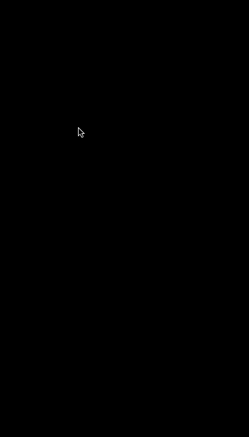
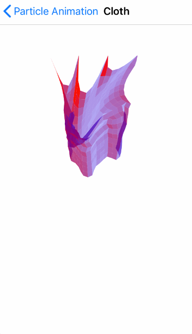
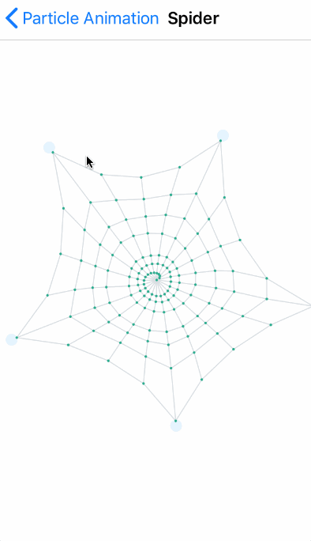
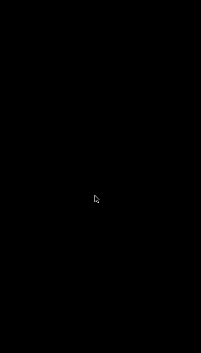

# ParticleAnimation
A iOS particle animation demo with Swift.

*Verlet demo is reference from a javascript Verlet physics engine [verlet-js](https://github.com/subprotocol/verlet-js)*

# Screenshot

